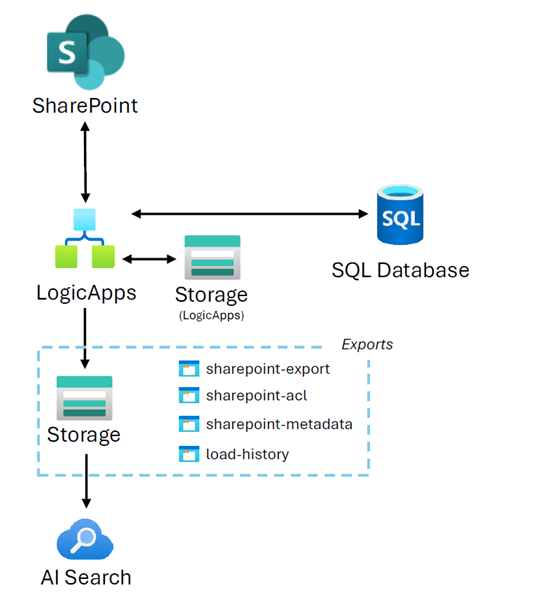
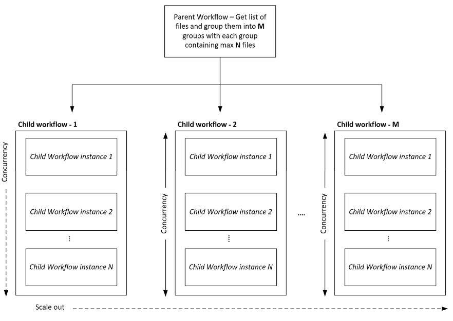

## Overview

This repository contains _LogicApps workflow_ pattern for _historic_ and _ongoing_ document export from SharePoint Online to Azure Storage, and enables ingestion into into the AI Search service. The AI Search ingestion is not included in this repository and can be added by configuring an AI Search indexer to pull data from Azure Storage where the Logic Apps workflows make the documents export available. You can also implement custom enrichment skill to include information such as document ACL (Access Control List), SharePoint URL, etc. into AI Search index by reading ACL and metadata files. The solution retains the hierarchy of the exported artefact (e.g. site -> document library -> parent folders -> artefact) when storing them to Azure Storage.

The workflows are built as _parent-child_ pattern to achieve parallel execution of child flow instances that fetch the artefacts from SharePoint. At the core the workflows leverage SharePoint Actions to get metadata, content and role assignment (ACL).

The ongoing workflows are meant to traverse slices of time from past to present on incremental basis, enabling gradual offloading of documents on a time slice (1 or N days) basis instead of querying everything in a single go.

Once the historic flows have been run to export all artefacts until present day, the ongoing flow should be enabled which will keep the exporting of newly added / modified documents going. The solution keeps the track of loaded datetime into Azure Storage, you can also change it to store this timestamp into a relational database like Azure SQL.

Both historic and ongoing LogicApps workflows need to be configured at appropriate recurrence based on your requirement. Ongoing flow should not be enabled before completion and disabling of historic flow.

Below picture summarises at high level how the flows export documents, ACL and associated metadata to different Azure Storage Containers (configurable).

The parent-child design choice for workflows facilitates horizontal scaling, allowing multiple files to be fetched simultaneously from SharePoint Online. This is illustrated in the picture below. Both M and N values can be modifiable.

## How to use this solution?

- Ensure that the Azure services shown in high level flow diagram are provisioned.
- Copy the workflow code into respective workflow artefact within Azure LogicApps (Standard hosting plan). This can be done in Azure Portal -> Logic Apps resource -> Workflows -> Workflows -> Add
- Copy common workflow parameters. Go to Azure Portal -> Logic Apps resource -> Workflows -> Parameters
- Update parameter values, important ones are all _\_container_name_ parameters and _sharepoint_site_address_.
- The workflows currently work for single SharePoint site URL, and can be updated to work on a list of site URLs as well.
- Create the metadata table in Azure SQL Database using provided SQL script. The metadata table not only provides overview of export progress but also used to identify when documents get renamed. You can modify its definition to include or remove fields as you deem necessary for your requirement.
- The workflow requires connections to Azure Storage, SharePoint online and Azure SQL. Ensure that these connections are created in the workflows.
- Review the configured properties of each action from each workflow and make updates as per your requirements.
- In order to reset the watermark, update the timestamp in blob-history.txt file in Azure Storage. This will bring back files again after the given timestamp value. The historic workflow set takes into account only file created timestamp, the ongoing workflow uses both file created or modified timestamp to determine which files to retrieve.
- To learn more go to [Azure Logic Apps documentation](https://learn.microsoft.com/en-us/azure/logic-apps/)

**Caution**

- Do not run directly on 1000s of sites and documents without testing on a smaller set (100-500) of documents first.
- Ensure to set concurrency limits to stay within the SharePoint request limits to avoid throttling.

**Disclaimer**

- The solution template is provided as is without any guarantees or warranties. It will require further adjustments and extensive testing to verify its suitability to your requirement in your environment.
